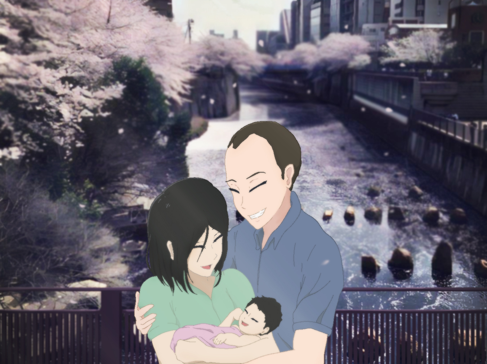

### Shibahara Family Postcard

Mehdi's baby Hana-chan has been born this week! 🎊 🎉

I'm planning to draw and paint a postcard and include everyone's messages/wishes.

I just use GitHub for fun (and free commits for everyone! lol)

_Plan_: I will send to him and archive this repo **by 2019/06/14 (Friday)**.

_To GitHub users_: Your message will be signed with your merge commit hash!

_To Non-GitHub users or people who want anonymity_: Just send me a message on Slack/LINE or wherever I shared the repo.

### How to Contribute

Simply make a PR and update `README.md` with the following format:

"\<message\>" - \<name\> (\<optional gitHub handle\>)

##### Example

- "Congratulations!" - John Doe (@johndoe59314134234)

### Current Postcard Progress

I don't have much free time this week, but I'll make sure to finish the post card before Friday!

### Messages

- "Congratulations on you greatest creation to date! Wishing you all the best for Hana-chan." - Omar Reid (@reido2012)
- “メディ、奥様ご出産おめでとうございます。無事お生まれになったと聞いて嬉しい限りです。忙しい中だと思いますが、お身体しっかりお休みになって是非これからの子育てを楽しんでください。メディ、また会えるのを楽しみにしています。” - Jun Iinuma
- "Congratulations and best wishes to your happy family!" - Dimitrios Bakinezos
- “Mehdi & Mehdi’s wife, congrats on what a joyous event! All the best on your next adventure in life." - Ayan Ray (@ayanray)
- "Congratulations and good luck with this new phase of your life" - Joe (@joebullard)
- "Congratulations on the birth of your baby girl, and best wishes for a happy future together!" - Emanuele Frandi (@efrandi)
